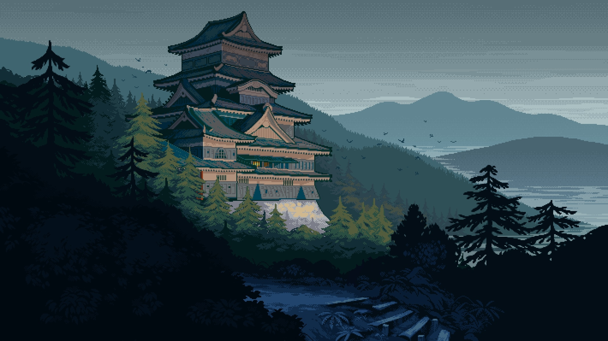
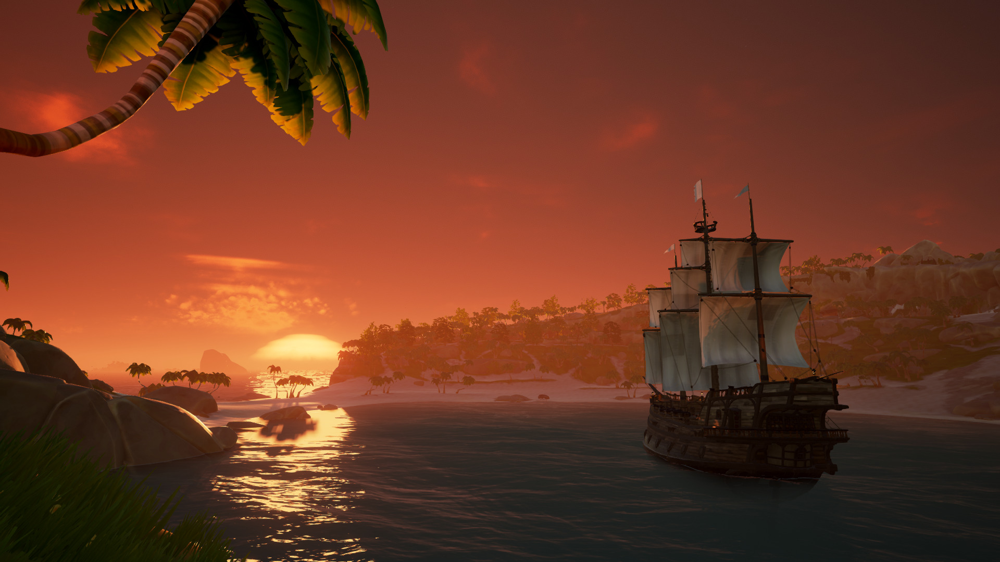

# A collection of Wallpapers

 

Most of this wallpapers i have got from [r/wallpapers](https://www.reddit.com/r/wallpapers/), or from rices from [r/unixporn](https://www.reddit.com/r/unixporn/), and most of it may be modified and/or resized.

## The wallpapers have this resolutions:
- **FHD** = 1920x1080px
- **QHD** = 2560×1440px
- **4K**  = 3840x2160px
- **custom** = Any size that is not listed above, and was not resized

## License
- The **wallpapers** in this repository come from various sources, and their licenses vary. Some may have restrictions on redistribution. If you are the author of any image and want it removed, please contact me.
- The **script** used to generate the `README.md` is licensed under the [MIT License](LICENSE).

## **Authors**

Aaron Alvarado

- [Unsplash](https://unsplash.com/@aaronalvaradome)

  

  
Wallpapers

  

  

Adam Jang

- [Unsplash](https://unsplash.com/@adamjang)
- [Instagram](https://www.instagram.com/adamjang)
- [X](https://x.com/adamjang)

  

  
Wallpapers

  

  

Alena Aenami

- [ArtStation](https://www.artstation.com/aenamiart)
- [Linktree](https://linktr.ee/aenami)

  

  
Wallpapers

  
  
  
  
  
  
  
  
  
  

  

Alex Knight

- [Unsplash](https://unsplash.com/@agk42)
- [Instagram](https://www.instagram.com/Agk42)
- [X](https://x.com/agkdesign)

  

  
Wallpapers

  
  

  

alvaroserpa

- [DeviantArt](https://www.deviantart.com/alvaroserpa)

  

  
Wallpapers

  

  

Andre Benz

- [Unsplash](https://unsplash.com/@trapnation)
- [X](https://x.com/benzspeaks)

  

  
Wallpapers

  

  

Andrew Coelho

- [Unsplash](https://unsplash.com/@andrewcoelho)

  

  
Wallpapers

  

  

Andrew Spencer

- [His Website](https://andrew-spencer.com/)
- [Unsplash](https://unsplash.com/@iam_aspencer)
- [Instagram](https://www.instagram.com/iam_aspencer)
- [X](https://x.com/iam_aspencer)

  

  
Wallpapers

  

  

Angelika Stephan

- [flickr](https://www.flickr.com/people/desomnis/)

  

  
Wallpapers

  

  

anindoghosh

- [Pixabay](https://pixabay.com/users/anindoghosh-16926735/)
- [Instagram](https://www.instagram.com/anindoghosh/)
- [X](https://x.com/anindo)

  

  
Wallpapers

  

  

Artem Beliaikin

- [Unsplash](https://unsplash.com/@belart84)

  

  
Wallpapers

  

  

Artem Shashkin

- [ArtStation](https://artyom.artstation.com/)
- [Instagram](https://www.instagram.com/artem_shashkin_art/)

  

  
Wallpapers

  

  

ArturGórecki

- [Pixabay](https://pixabay.com/users/arturg%C3%B3recki-2233926/)

  

  
Wallpapers

  

  

Asad Photo

- [Pexels](https://www.pexels.com/@asadphoto/)

  

  
Wallpapers

  

  

BisBiswas

- [ArtStation](https://imbis.artstation.com/)
- [DeviantArt](https://www.deviantart.com/bisbiswas)
- [Instagram](https://www.instagram.com/hereisbis/)

  

  
Wallpapers

  
  
  
  

  

Bogomil Mihaylov

- [Unsplash](https://unsplash.com/@bogomi)
- [Instagram](https://instagram.com/ojobojo)

  

  
Wallpapers

  

  

Carmine De Fazio

- [Unsplash](https://unsplash.com/@carminu)
- [Instagram](https://www.instagram.com/carminu)
- [X](https://x.com/Carmins)

  

  
Wallpapers

  

  

ChingP

- [Reddit](https://www.reddit.com/user/ChingP/)

  

  
Wallpapers

  

  

Cristiano Mozzillo

- [Unsplash](https://unsplash.com/@mozzillo_cristiano)
- [500px](https://500px.com/p/cristianomozzillo)

  

  
Wallpapers

  

  

CUtePOiSOn77

- [Reddit](https://www.reddit.com/user/CUtePOiSOn77/)

  

  
Wallpapers

  

  

Cátia Matos

- [Pexels](https://www.pexels.com/@catiamatos)
- [Darkroom](https://catiamatos.darkroom.tech/)
- [Instagram](https://www.instagram.com/catia.matos/)

  

  
Wallpapers

  

  

Dan Convey

- [Unsplash](https://unsplash.com/@danconvey)

  

  
Wallpapers

  

  

Daniel Leone

- [His Website](https://danielleone.com/)
- [Unsplash](https://unsplash.com/@danielleone)

  

  
Wallpapers

  

  

Danyu Wang

- [Unsplash](https://unsplash.com/@dandandan0101)
- [Instagram](https://www.instagram.com/w_danyu)

  

  
Wallpapers

  

  

Dave Herring

- [His Website](https://dave.online/)
- [Unsplash](https://unsplash.com/@daveherring)

  

  
Wallpapers

  

  

davimachado

- [Pixabay](https://pixabay.com/users/davimachado-28498918/)

  

  
Wallpapers

  

  

Digital Frontiers

- [ArtStation](https://digitalfrontiers.artstation.com/)

  

  
Wallpapers

  

  

Dominik Zdenković

- [His Website](https://dominikzdenkovic.com/)
- [ArtStation](https://www.artstation.com/dominikzdenkovic)
- [Linktree](https://linktr.ee/dominikzdenkovic)

  

  
Wallpapers

  
  

  

Dylan Furst

- [500px](https://500px.com/p/fursty?view=photos)
- [Instagram](https://www.instagram.com/fursty/)

  

  
Wallpapers

  

  

Dynamo2205

- [Reddit](https://www.reddit.com/user/Dynamo2205/)

  

  
Wallpapers

  

  

einsbern

- [tumblr](https://einsbern.tumblr.com/)
- [X](https://x.com/_einzbern)

  

  
Wallpapers

  

  

Elias Tigiser

- [Pexels](https://www.pexels.com/@elias-tigiser-411757)
- [Instagram](https://www.instagram.com/elias_tigiser/)

  

  
Wallpapers

  

  

FORREST CAVALE

- [Unsplash](https://unsplash.com/@forrestcavale)

  

  
Wallpapers

  

  

Gabriela Wasiewicz

- [ArtStation](https://glla.artstation.com/)

  

  
Wallpapers

  

  

Gleb Kozenko

- [Unsplash](https://unsplash.com/@glebson)
- [Instagram](https://www.instagram.com/gleb.kozenko/)

  

  
Wallpapers

  

  

Glen Sinclair

- [flickr](https://www.flickr.com/photos/144273526@N06)

  

  
Wallpapers

  

  

Helena Lopes

- [Pexels](https://www.pexels.com/@wildlittlethingsphoto/)

  

  
Wallpapers

  

  

hipydeus

- [flickr](https://www.flickr.com/people/hipydeus/)

  

  
Wallpapers

  
  

  

irbChad

- [Reddit](https://www.reddit.com/user/irbChad/)

  

  
Wallpapers

  

  

Jack B

- [Unsplash](https://unsplash.com/@nervum)

  

  
Wallpapers

  
  

  

Jamie Street

- [Unsplash](https://unsplash.com/@jamie452)

  

  
Wallpapers

  

  

Johannes Hulsch

- [His Website](https://johanneshulsch.de/)
- [flickr](https://www.flickr.com/photos/95951531@N05/)
- [500px](https://500px.com/p/bokehm0n?view=photos)
- [Instagram](https://www.instagram.com/bokehm0n/)

  

  
Wallpapers

  
  

  

Joshua Newton

- [Unsplash](https://unsplash.com/@joshuanewton)
- [Instagram](https://www.instagram.com/momentsbyjosh/)

  

  
Wallpapers

  

  

JULIAN CALLE

- [ArtStation](https://www.artstation.com/handsdigitalstudio)

  

  
Wallpapers

  

  

KAL VISUALS

- [Unsplash](https://unsplash.com/@kalvisuals)

  

  
Wallpapers

  

  

Kanistra Studio

- [His Website](https://kanistra.com/)
- [ArtStation](https://www.artstation.com/kanistrastudio)
- [X](twitter.com/kanistra_studio)
- [Sketchfab](https://sketchfab.com/kanistra)

  

  
Wallpapers

  

  

konstantin chimaera

- [Unsplash](https://unsplash.com/@chimaerra)

  

  
Wallpapers

  

  

Larry Chen

- [Unsplash](https://unsplash.com/@chen_idragon)

  

  
Wallpapers

  

  

LEIKOI

- [ArtStation](https://www.deviantart.com/leikoi)
- [Instagram](https://www.instagram.com/leik0i/)
- [X](https://x.com/LEIK0I)
- [Patreon](https://www.patreon.com/LEIKOI)

  

  
Wallpapers

  

  

liamwong

- [His Website](https://www.liamwong.com/)
- [Instagram](https://www.instagram.com/liamwong)
- [X](https://x.com/liamwong)

  

  
Wallpapers

  
  

  

Louis Coyle

- [His Website](https://louie.co.nz/)
- [Dribbble](https://dribbble.com/louiscoyle)
- [CodePen](https://codepen.io/dropside)
- [X](https://x.com/louis_coyle)
- [Facebook](https://www.facebook.com/louis.j.coyle)

  

  
Wallpapers

  

  

Mark Boss

- [His Website](https://markboss.me/)
- [Unsplash](https://unsplash.com/@vork)
- [X](https://x.com/markb_boss)

  

  
Wallpapers

  

  

Marser

- [flickr](https://www.flickr.com/photos/marser/)

  

  
Wallpapers

  
  

  

Mike Yukhtenko

- [Unsplash](https://unsplash.com/@yamaicle)
- [Instagram](https://www.instagram.com/ya.maicle/)

  

  
Wallpapers

  

  

Monster Du

- [ArtStation](https://dumonster.artstation.com/)

  

  
Wallpapers

  

  

Nahil Naseer

- [Unsplash](https://unsplash.com/@nahilnaseer)
- [Instagram](https://www.instagram.com/nahilnaseer)
- [X](https://x.com/Nahil_Naseer)

  

  
Wallpapers

  

  

Ori-Cloud

- [DeviantArt](https://www.deviantart.com/ori-cloud/gallery)

  

  
Wallpapers

  

  

Pascal Debrunner

- [Unsplash](https://unsplash.com/@debrupas)
- [Instagram](https://www.instagram.com/pd_visuals/)

  

  
Wallpapers

  

  

Paul Pastourmatzis

- [His Website](https://pueblo-vista.com/)
- [Unsplash](https://unsplash.com/@pueblovista)
- [Instagram](https://www.instagram.com/pueblo_vista/)
- [X](https://x.com/pueblovista)

  

  
Wallpapers

  

  

Pok Rie

- [Pexels](https://www.pexels.com/@pok-rie-33563)
- [Instagram](https://www.instagram.com/pok_rie/)

  

  
Wallpapers

  

  

PrisonerCoin

- [ArtStation](https://www.deviantart.com/prisonercoin)
- [X](https://x.com/CoinPrisoner)
- [Steam](https://steamcommunity.com/id/Prisoner_Coin/)

  

  
Wallpapers

  
  

  

Ricardo Gomez Angel

- [His Website](https://rgaleria.com/)
- [Unsplash](https://unsplash.com/@rgaleriacom)
- [Instagram](https://www.instagram.com/ricardogo03/)

  

  
Wallpapers

  

  

Ronaldo de Oliveira

- [His Website](https://ronaldorolv.myportfolio.com/)
- [Unsplash](https://unsplash.com/@ronaldordeoliveira)
- [Instagram](https://www.instagram.com/ronaldordeoliveira)

  

  
Wallpapers

  

  

saira ahmed

- [His Website](https://saira.mypixieset.com/)
- [Unsplash](https://unsplash.com/@sairaa)
- [Instagram](https://www.instagram.com/sairaphotography)
- [X](https://x.com/sairaahmeddd)

  

  
Wallpapers

  

  

Samuel Berner

- [Unsplash](https://unsplash.com/@saaam_chan)

  

  
Wallpapers

  

  

Sayybils

- [His Website](https://sayybilsnakirwa.wixsite.com/portofolio)
- [ArtStation](https://www.artstation.com/sayybils)
- [Instagram](https://www.instagram.com/sayybils)

  

  
Wallpapers

  

  

SuicidalMushroom

- [ArtStation](https://www.deviantart.com/suicidalmushroom)

  

  
Wallpapers

  

  

Taras Makarenko

- [Pexels](https://www.pexels.com/@taras-makarenko-188506)
- [Instagram](https://instagram.com/gotocalifornia/)

  

  
Wallpapers

  

  

Tim Mossholder

- [His Website](https://timmossholder.com/)
- [Unsplash](https://unsplash.com/@timmossholder)
- [X](https://x.com/timmossholder)

  

  
Wallpapers

  

  

Trey Ratcliff

- [flickr](https://www.flickr.com/people/stuckincustoms/)
- [Linktree](https://linktr.ee/treyratcliff)

  

  
Wallpapers

  

  

Troy Qian

- [Unsplash](https://unsplash.com/@troyqian)
- [Instagram](https://instagram.com/ycq_troy)

  

  
Wallpapers

  

  

Tyler Smith

- [ArtStation](https://tsmith3d.artstation.com/)

  

  
Wallpapers

  
  
  
  

  

