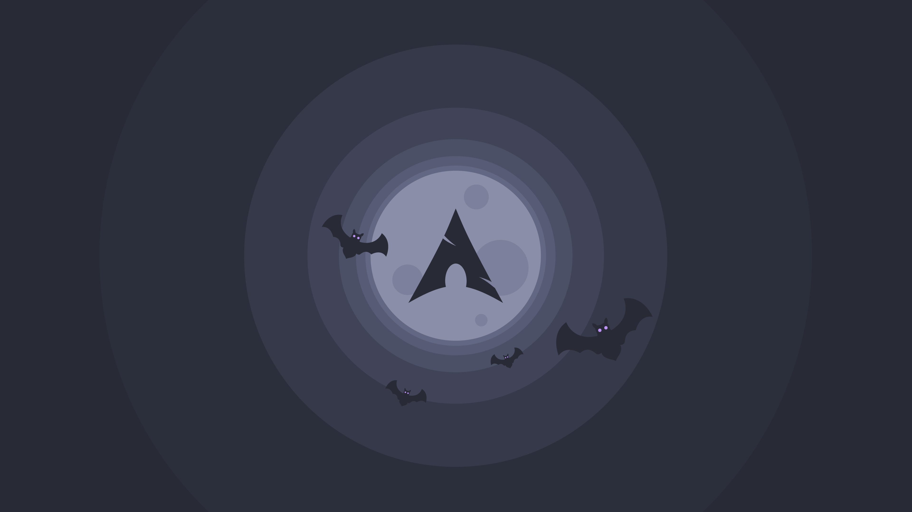
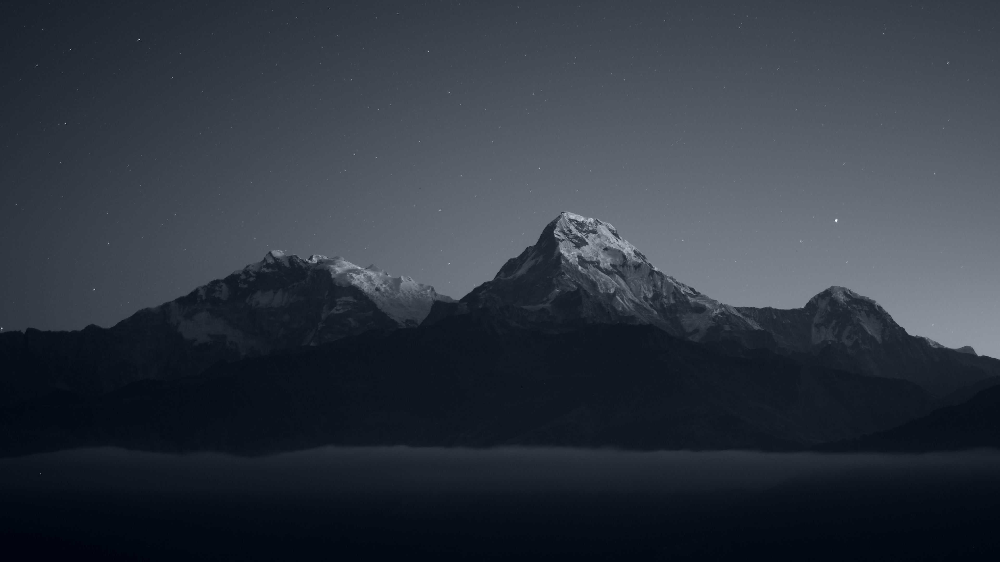

# A collection of Wallpapers

Most of this wallpapers i have got from [r/wallpapers](https://www.reddit.com/r/wallpapers/), or from rices from [r/unixporn](https://www.reddit.com/r/unixporn/), and most of it may be modified and/or resized.

## The wallpapers have this resolutions:
- **FHD** = 1920x1080px
- **QHD** = 2560×1440px
- **4K** = 3840x2160px
- **custom** = Any size that is not listed above, and was not resized

## **Authors**

Alena Aenami

- [ArtStation](https://www.artstation.com/aenamiart)
- [Links](https://linktr.ee/aenami)

    

    
Wallpapers

    

    

    

    

    

    

    

    

 

Artem Shashkin

- [ArtStation](https://artyom.artstation.com/)
- [Instagram](https://www.instagram.com/artem_shashkin_art/)

    

    
Wallpapers

    

    

    

 

Dracula Theme

- [Dracula site](https://draculatheme.com/)
- [GitHub](https://github.com/dracula/dracula-theme)

    

    
Wallpapers

    
    

    

 

Daniel Leone

- [His website](https://danielleone.com/)
- [Unsplash](https://unsplash.com/@danielleone)

    

    
Wallpapers

    
    

    

 

*(I will be searching for the missing authors)*